Basic Ecommerce website for Cosmetics Products.

The website contains beauty and cosmetics products. Users can register themselves and order the products they wish.
Website has some features like adding products to wishlist, cart and checking past orders.
Users can also track any order using their respective orderid provided at the time of order confirmation.
 
Technologies Used: 
 
FrontEnd: 
 
1.HTML + CSS 
2.BOOTSTRAP 
3.JAVASCRIPT 
 
BackEnd: 
 
1.XAMPP SERVER (Apache Sever). 
2.PHP (Server side scripting). 
3.MYSQL (Database). 

Screenshots:

<b>1. Home Page</b>

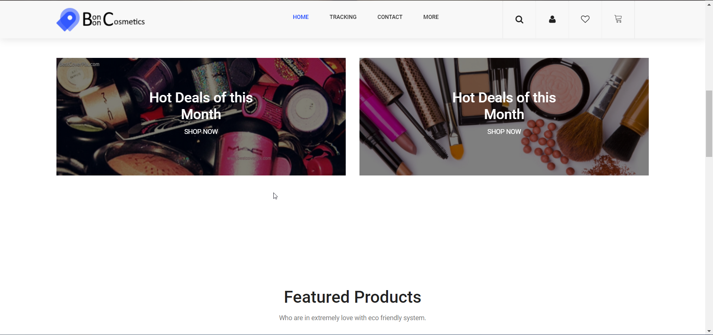

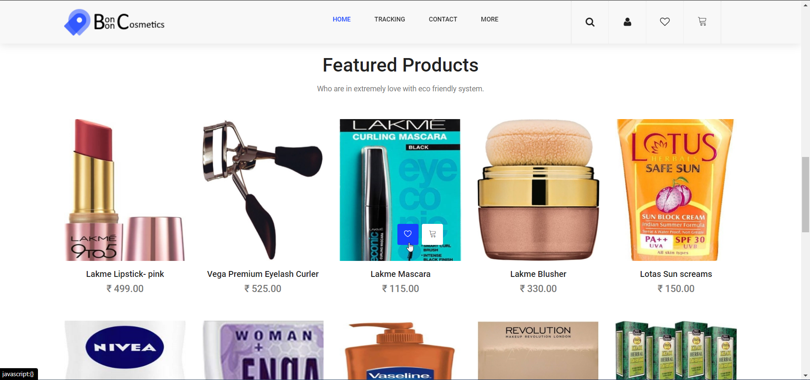

<b>2. Custom Search</b>
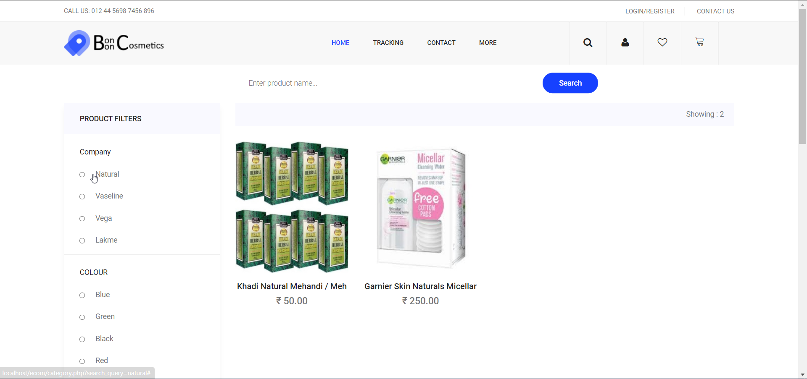

<b>3.Login</b>

<b>4. Cart</b>
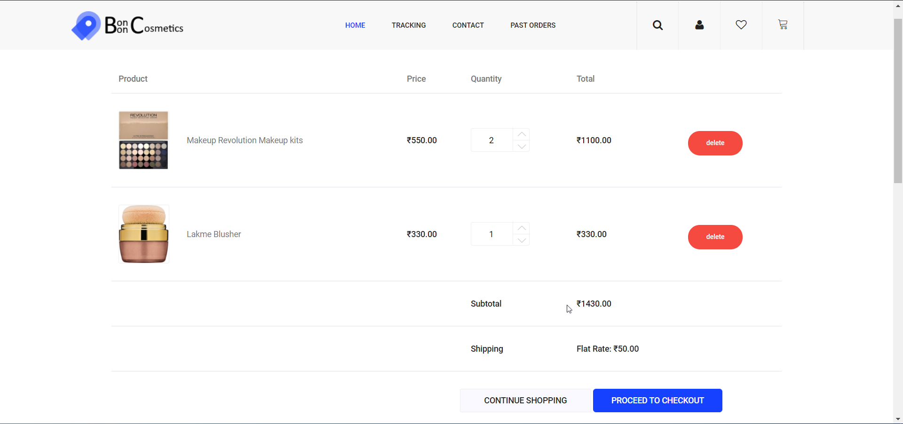

<b>5. Payment</b>
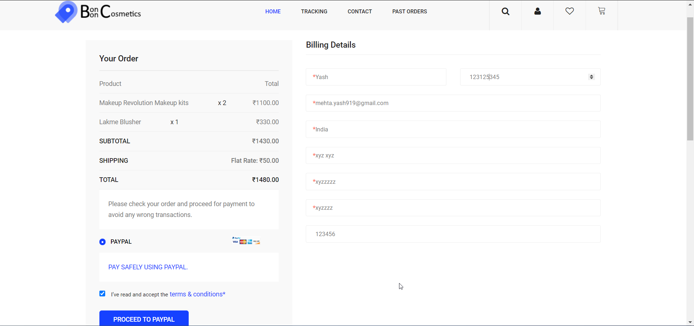

<b>6. Order Confirmation</b>
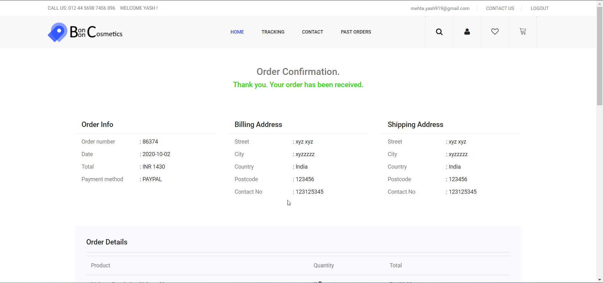

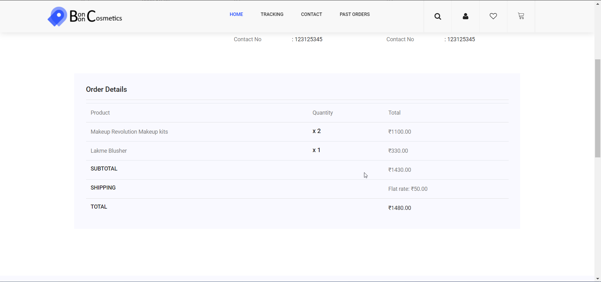

<b>7. Past Order</b>
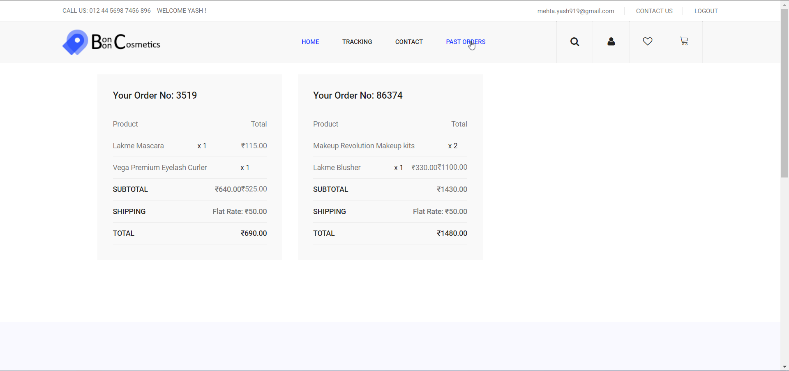

<b>8. Track Order</b>
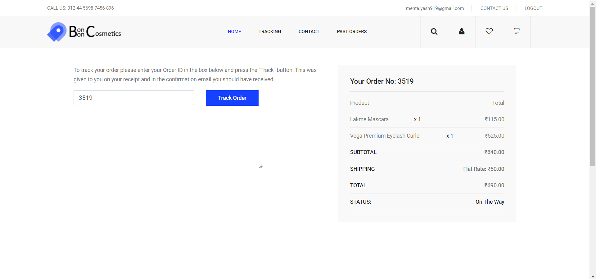

<b>9. All products</b>
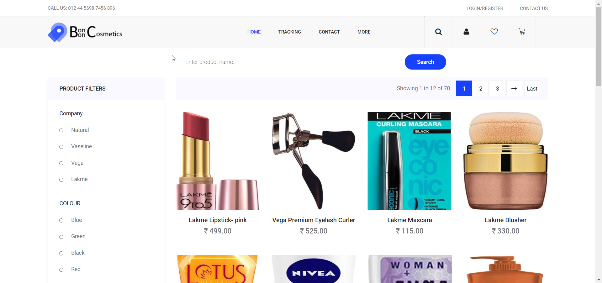

<b>10.Contact Us</b>
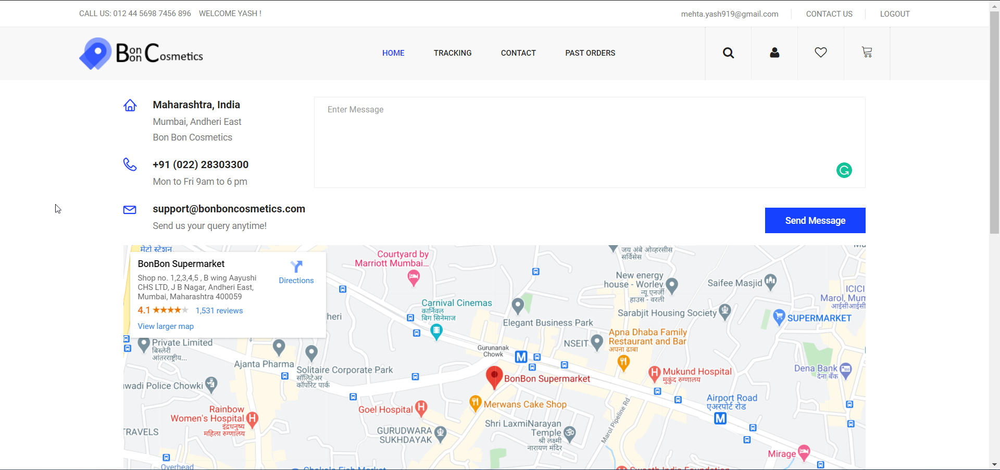

